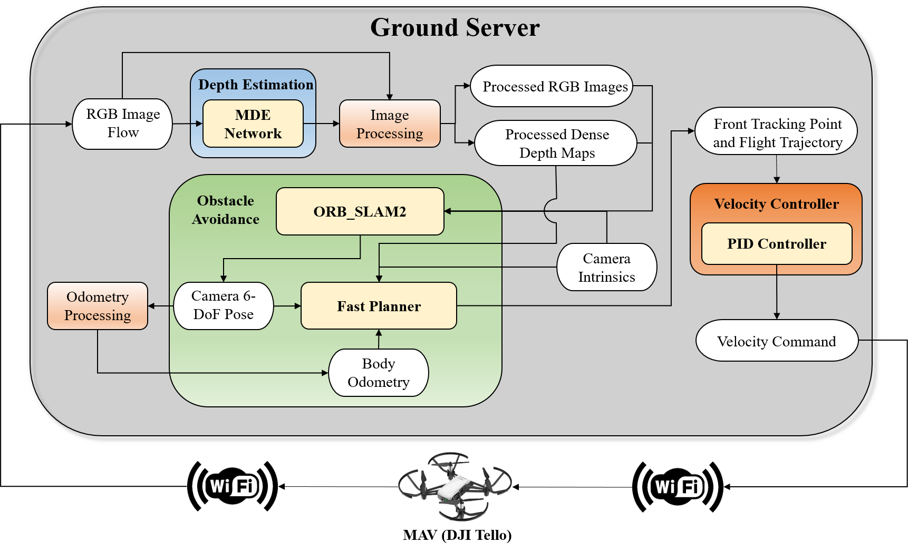

# Monocular Navigation
Our work has been accepted by [ICAUS2022](https://icaus2022.scimeeting.cn/cn/web/index/12954_990754__). Please check our experimental video [here](https://space.bilibili.com/1622930364).

## Introduction
The repository includes the source code of the autonomous obstacle avoidance system proposed in our paper. 
We have developed an autonomous obstacle avoidance system for the micro-aerial vehicle (MAV) based on monocular depth estimation (MDE).

The 6-DoF pose estimation and trajectory planning are implemented with [ORB-SLAM2](https://github.com/raulmur/ORB_SLAM2) and [Fast-Planner](https://github.com/HKUST-Aerial-Robotics/Fast-Planner), respectively. Several monocular depth estimation algorithms with distinctive characteristics are applied and evaluated. [The experimental results]() show that both depth accuracy and scale consistency play significant roles in real-world micro-aerial vehicle navigation.

## How to Run
The program includes 5 ROS packages ([1](https://github.com/YongzhouPan/Mono-Navigation/tree/main/1_tello_driver_ws), [3](https://github.com/YongzhouPan/Mono-Navigation/tree/main/3_data_proc_ws), [4](https://github.com/YongzhouPan/Mono-Navigation/tree/main/4_orb_slam_2_ws), [5](https://github.com/YongzhouPan/Mono-Navigation/tree/main/5_fast_planner_ws), [6](https://github.com/YongzhouPan/Mono-Navigation/tree/main/6_drone_controller_ws)) and a ROS package collection ([2](https://github.com/YongzhouPan/Mono-Navigation/tree/main/2_monocular_depth_ROS)). The labels of items show the running order. Please click the workspace to learn more specific details on setup, compilation and operation.

## Experimental Configuration
We have tested all the packages on `ROS Melodic` for `Ubuntu 18.04`. The CPU of the laptop is *`Intel i7-10875H`* and the GPU is *`NVIDIA GeForce RTX 2070 Super Max-Q`*.  The GPU driver version is `450.51.06` and the CUDA version is `11.0`. We recommend you to manage the MDE workspaces with Anaconda Virtual Enviroment.

## Citation
If you publish work based on, or using, this code, we would appreciate the citation to the following:

    @inproceedings{yp22icaus,
        author       = {Yongzhou Pan and Jingjing Wang and Fengnan Chen and Zheng Lin and Siyao Zhang and Tao Yang},
        title        = {How Does Monocular Depth Estimation Work for MAV Navigation in The Real World?},
        booktitle    = {Proceedings of the 2022 International Conference on Autonomous Unmanned Systems (ICAUS)},
        month        = {September},
        year         = {2022}
        }      

## Update
The `README` is an initial version and we will improve it with more details in the coming months.
